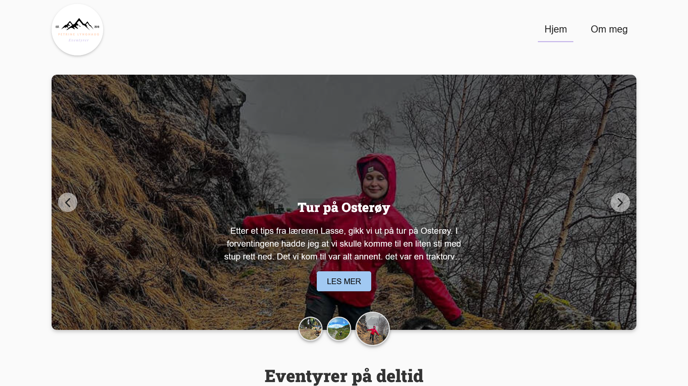

# Summer 2024 Exam, Blogg. 
https://friluftslivbloggen.netlify.app/




## Description
For our exam, we were assigned to create a blog with a topic of our choice. The blog needed to have a functional login system, a feature to delete posts, edit posts, and create new posts. Additionally, it had to include a carousel that stops when hovered over, rather than operating automatically. All images had to be incorporated via URLs through an API.

My blog focused on outdoor activities. I chose to concentrate on component-based JavaScript for this project, which proved to be very educational.


## Built With

You can list a the tech stack that you've used over here
- Javascript
- CSS
- HTML

## Getting Started

### Installing

1. Clone the repo:

```bash
git git@github.com:EPetrineLynghaug/Frilutslivblogg.git
```

## Contact

- [My LinkedIn page](https://www.linkedin.com/in/petrine-lynghaug/)
- Petrinelynghaug@gmail.com